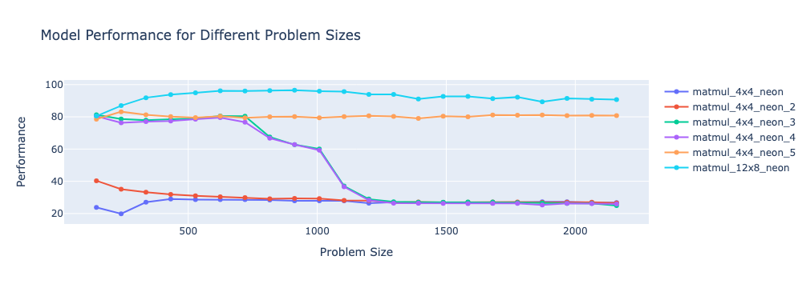

# Matrix Multiplication with NEON Optimizations
### Project Overview
This project explores the performance of various implementations of a naive 4x4 matrix multiplication algorithm optimized using NEON instructions. NEON is an advanced SIMD (Single Instruction, Multiple Data) architecture extension for ARM processors, designed to accelerate multimedia and signal processing applications. The project aims to compare the performance of five different implementations of the naive matrix multiplication algorithm across a range of problem sizes.

This plot visualizes the performance of five different NEON-optimized implementations of naive 4x4 matrix multiplication across a range of problem sizes. The x-axis represents the problem size, while the y-axis represents the performance metric. The legend differentiates between the five implementations. naive_matmul_4x4_neon_5 demonstrates the best and most stable performance across varying problem sizes. Other implementations show varying degrees of performance stability and degradation as the problem size increases.